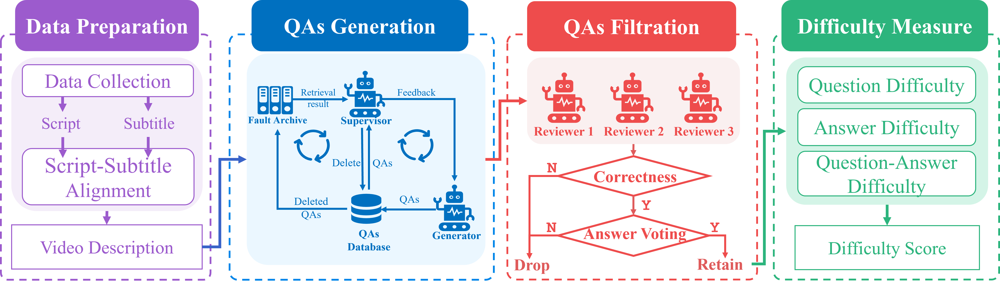
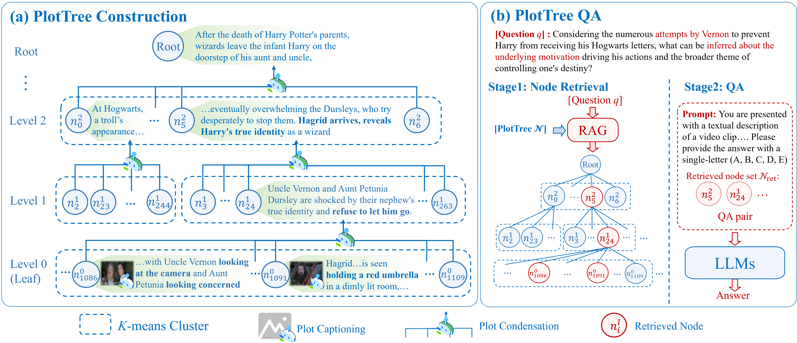

# StoryVideoQA: Scaling Deep Video Understanding with a Large-Scale, Multi-Genre and Auto-Generated Dataset

<div style='display:flex; gap: 0.5rem; '>
        	<a href='https://github.com/nercms-mmap'></a>
    <a href='https://huggingface.co/datasets/ZQFive/StoryVideoQA'></a>


------

## 📊 StoryVideoQA Datasets

Due to the large scale of the StoryVideo dataset, we have made it available on the Hugging Face platform for better management and accessibility. The StoryVideoQA dataset includes Question-Answer pairs (QAs) and a character face repository, enabling researchers and developers to easily engage in deep video understanding tasks.

You can access the datasets via the following links:

- 🤗[StoryVideoQA Dataset](https://huggingface.co/datasets/ZQFive/StoryVideoQA)


------

## ⚙️ StoryMindv2 for the construction of StoryVideoQA



### **Environment Setup (This project work in StoryMindv2 directory):**

```bash
cd StoryMindv2
pip install -r requirements.txt
```

### **StoryMindv2 consists of 4 stage:**

1. **Data Preparation**

   The final result of script-subtitle alignment are directly stored in `StoryMindv2/aligned_script`,  i.e., 


```bash
StoryMindv2/
    └── aligned_script/
        ├── BigBang           # Aligned script-subtitle files of TV series: The BigBang Theory
        ├── Friends           # Aligned script-subtitle files of TV series: Friends
        ├── GOT               # Aligned script-subtitle files of TV series: GOT
        ├── Movie             # Aligned script-subtitle files of Movies from IMDB and Douban
        └── video_length.json # Different video length of TV series/Movie in StoryVideoQA    
```

2. **QAs Generation**

   This stage can be executed by running the script `sh sh/QAsGen.sh` directly, i.e., 

```bash
# Run the QAsGen script with specified parameters
CUDA_VISIBLE_DEVICES=0 python QAsGen.py --gemini_model gemini-2.0-flash \                           
           --gemini_key "Replace with your Gemini API key" \           
           --gemini_proxy "Replace with your Gemini proxy address" \ 
           --each_type_num 100 \                    # Number of QAs for each fine-grained topic
           --vid_dir Friends                        # The script will use data from aligned_script/{vid_dir}
```

3.  **QAs Filtration**

  This stage can be executed by running the script `sh sh/QAsFil.sh` directly, i.e., 


```bash
python QAsFil.py --openai_model gpt-4.1-2025-04-14 \
                 --openai_key "Replace with your GPT API key" \
                 --openai_proxy "Replace with your GPT proxy address" \
                 --gemini_model gemini-2.0-flash \
                 --gemini_key "Replace with your Gemini API key" \           
                 --gemini_proxy "Replace with your Gemini proxy address" \ 
                 --claude_model claude-3-7-sonnet-20250219 \
                 --claude_key "Replace with your Claude API key" \          
                 --claude_proxy "Replace with your Claude proxy address" \ 
                 --vid_dir Friends \   # The script will use data from aligned_script/{vid_dir} for Reviewer
                 --start 0 \           # Start index of generated csv
                 --end 999             # End index of generated csv

python export.py --vid_dir Friends \                           # Filter QAs based on Filtration result
                 --output_path json/filter_QAs.json \          # output path of filtered QAs
```

4. **Difficulty Measure**
   
    This stage can be executed by running the script `sh sh/QAsDiff.sh` directly, i.e., 


```bash
python diff_measure.py --questions_path json/filter_QAs.json \               # path of filtered QAs
          --output_path "json/all_questions_info_with_difficulty.json"       # output QAs with diff score
```


------

## ⚙️ PlotTree for Deep Video Understanding Task




### Environment Setup

Before running the code, please make sure to prepare the Python environment properly.

1. **Install dependencies**

   We recommend creating a clean virtual environment (e.g., via `conda` or `venv`) and then installing the required dependencies:

   ```bash
   cd PlotTree
   pip install -r requirements.txt
   ```

2. **Update `kmeans-pytorch` library  (Since we revise the distance for K-means)**

   ```bash
   git clone https://github.com/subhadarship/kmeans_pytorch
   cd kmeans_pytorch
   ```

   Replace the `__init__.py` file in the `kmeans_pytorch` directory with the modified version provided in `./kmeans_pytorch` of this repository.

   Then, install the updated package locally:

   ```bash
   pip install --editable .
   ```

### Video Data Preparation

- Due to copyright restrictions associated with TV series and movies, researchers are therefore required to **obtain the relevant videos independently** and place them in the `data/video` directory. In addition, please download and unzip the character library from [Character.zip · ZQFive/StoryVideoQA](https://huggingface.co/datasets/ZQFive/StoryVideoQA/blob/main/Character.zip)  to  `data/Character` directory.
- Once the videos are prepared, you can extract keyframes using the script `data_extraction/extract_images.py`, which samples frames at a default rate of `1 fps`.
-  After obtaining keyframes, you can perform plot captioning using the provided shell script `sh/cap.sh`.

For convenience, we have provided **pre-generated plot captioning results** for the *StoryVideoQA-G* subset in the `data/captions` directory.


### PlotTree Construction and PlotTreeQA

1. **PlotTree Construction**

   This stage can be executed by running the script `sh sh/plotTree.sh` directly, i.e.,

   ```bash
   SHARED_PARAMS="--output_base_dir results/PlotTree \
                  --llm_model Gemini-2.0-flash \
                  --openai_model gemini-2.0-flash \
                  --openai_key "Replace with your LLM API Key" \
                  --openai_proxy "Replace with your LLM API Proxy" \
                  --compression_factor 36 \    # compression rate between two layers
                  --temporal_weight 10 \       # scaling factor of distance function for K-means
                  --min_nodes_in_cluster 2"
   
   
   CUDA_VISIBLE_DEVICES=0 python plotTree.py --captions_path data/captions/Friends_PlotTree.json $SHARED_PARAMS
   CUDA_VISIBLE_DEVICES=0 python plotTree.py --captions_path data/captions/BigBang_PlotTree.json $SHARED_PARAMS
   CUDA_VISIBLE_DEVICES=0 python plotTree.py --captions_path data/captions/GOT_PlotTree.json $SHARED_PARAMS
   CUDA_VISIBLE_DEVICES=0 python plotTree.py --captions_path data/captions/Movie_PlotTree.json $SHARED_PARAMS
   ```

2. **PlotTree QA**

   This stage can be executed by running the script `sh sh/plotTreeqa.sh` directly, i.e.,

   ```bash
   SHARED_PARAMS="--plotTree_name PlotTree \
                  --description_type full \
                  --tree_output_base_dir results/PlotTree \
                  --llm_model Gemini-2.0-flash \
                  --compression_factor 36  \   # compression rate between two layers
                  --temporal_weight 10 \       # scaling factor of distance function for K-means
                  --max_rag_nodes 32 \         # rag node on PlotTree
                  --openai_model gemini-2.0-flash \
                  --openai_key "Replace with your LLM API Key" \
                  --openai_proxy "Replace with your LLM API Proxy" \
                  --json_ouput_dir results/QA"
   
   CUDA_VISIBLE_DEVICES=0 python plotTreeqa.py --vid_dir Friends $SHARED_PARAMS
   CUDA_VISIBLE_DEVICES=0 python plotTreeqa.py --vid_dir BigBang $SHARED_PARAMS
   CUDA_VISIBLE_DEVICES=0 python plotTreeqa.py --vid_dir GOT $SHARED_PARAMS
   CUDA_VISIBLE_DEVICES=0 python plotTreeqa.py --vid_dir Movie $SHARED_PARAMS
   ```

3. Calculate Metrics 

   If use our default setting of PlotTree, you can directly use following script to calculate metrics for PlotTree

   ```bash
   python metrics.py
   ```

   
